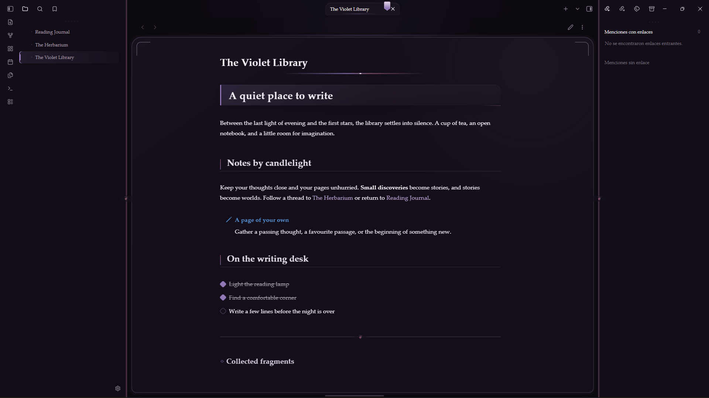
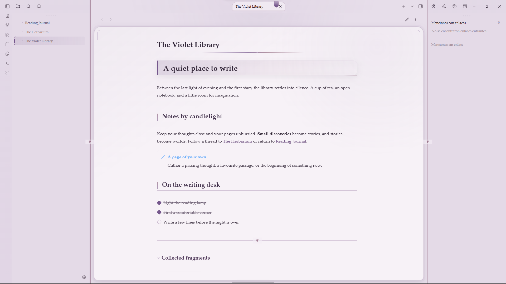

# Dark Paradise Cupertino

Here I go again with another Obsidian theme. I made this one because I wanted something purple that felt more like me. I used [Cupertino](https://github.com/aaaaalexis/obsidian-cupertino) by **aaaaalexis** as the base for its beautiful animations, then layered in my own color palette and visual direction: a cozy medieval violet theme with serif typography and a rounded Violet Codex reading surface.


> This package is prepared for a future fork. It is not affiliated with Obsidian or the Cupertino maintainers.

## Screenshots

| Dark mode | Light mode |
| --- | --- |
|  |  |

## Features

- Cupertino's fluid desktop, mobile, sidebar, tab, modal, and animation system
- A deep violet dark mode with plum surfaces, lavender text, amethyst accents, and a darker reading page
- A warm parchment light mode that keeps purple as the identity color
- Rounded Violet Codex framing for the editor and reading view, with chapter-like headings and a small active-tab bookmark
- Cozy serif typography with safe fallbacks when Alegreya, Cinzel, or Cormorant are unavailable
- Manuscript-inspired details including diamond list markers, sword checkboxes, gradient separators, decorated metadata, and glowing active states
- Mobile-aware behavior that flattens the desktop frame, preserves usable touch targets, and reduces decorative density on narrow screens
- Optional Cupertino controls for layout, density, animation, color scheme, and reading width through [Style Settings](https://github.com/mgmeyers/obsidian-style-settings)

## Installation

The theme is not currently listed in Community Themes. Publishing a GitHub fork does not automatically add it to the community directory.

### Manual

1. Download `theme.css` and `manifest.json` from this repository or the release you want to test.
2. Create a `Dark Paradise Cupertino` folder inside your vault's `.obsidian/themes/` directory.
3. Place both files in the new folder.
4. Select **Dark Paradise Cupertino** under **Settings** -> **Appearance** -> **Themes**.

The theme requires **Obsidian 1.13.4 or newer**.

## Color modes

- **Dark mode** is the primary experience: black-plum surfaces, dusty lavender text, rosewood accents, candlelit gold details, and a lower-luminance reading surface.
- **Light mode** turns the same structure into a muted parchment page with amethyst controls and readable dark text.
- **Mobile mode** keeps the palette and typography while flattening the desktop frame so the document gets the available width.

## Source layout

```text
Dark Paradise Cupertino/
├── theme.css          # compiled stylesheet loaded by Obsidian
├── manifest.json      # theme metadata and minimum Obsidian version
├── versions.json      # Obsidian compatibility map
├── src/               # Cupertino SCSS source tree retained for the fork
├── img/               # verified dark/light previews plus legacy interface assets
├── cupertino.png      # upstream theme preview asset
└── LICENSE.txt       # MIT terms for the upstream and local changes
```

`theme.css` is the distributable file that Obsidian loads and currently contains customizations not reproduced by `src/theme.scss`. Compiling that SCSS file alone would lose those additions. The `src/` tree is retained for reference when reconciling upstream changes. Local restore points use the `theme.css.before-*` and `theme.css.scriptorium-*` patterns and are excluded by `.gitignore`.

The `desktop-dark.png` and `desktop-light.png` previews were captured from a separate demonstration vault containing only fictional notes. The remaining image files are retained as legacy interface assets from the original theme package.

## Credits

- [Cupertino](https://github.com/aaaaalexis/obsidian-cupertino) by **aaaaalexis** — base layout, interactions, animations, mobile behavior, and source structure.
- **Dark Paradise** by **Repo** — violet palette, cozy medieval art direction, typography, contrast tuning, mobile refinements, and Violet Codex framing.

## Project status

The theme is currently kept private while the fork package, metadata, and attribution are reviewed. No GitHub fork or public release has been created yet.

## License

MIT License. See [`LICENSE.txt`](LICENSE.txt). The original Cupertino copyright attribution is preserved there alongside attribution for this fork's modifications.
